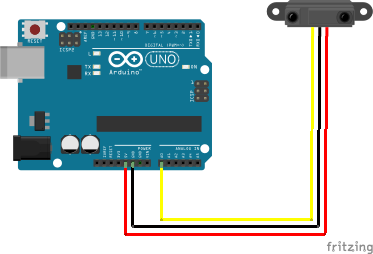
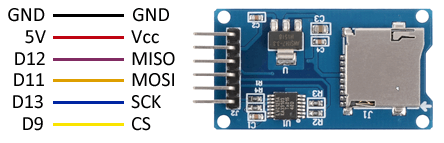

# Aplicaciones Tecnológicas 3 y 4 2024

En este repositorio dejaré los códigos y archivos utilizados en las clases de Aplicaciones Tecnológicas 3 y 4 del año 2024.

### Clase #3 Sonic Pi:

[Código Acá ](clase_3/README.md)

#### Tarea en clases: 

Programar la canción de Mario Bros utilizando listas en notación MIDI
  - Agregar un Sintetizador utilizando "use_synth".
  - Modificar la velocidad con "use_bpm".
  - Grabar un WAV con sus creaciones con el botón REC.

Pueden basarse en las notas del siguiente repositorio:

[Click aquí](https://gist.github.com/CodyJung/2315618)

### Clase #4 MIDI + Arduino + SonicPi:

[Códigos Acá ](clase_4/README.md)

#### Tarea clases:

Diseñar un Instrumento MIDI con Arduino utilizando un [Sensor de Distancia IR](https://naylampmechatronics.com/blog/55_tutorial-sensor-de-distancia-sharp.html) SHARP GP2Y0A21 o GP2Y0A02.
  - Utilizar la función [map](https://www.arduino.cc/reference/en/language/functions/math/map/) de arduino para mapear los valores de 10 bits (0-1023) del sensor a 7 bits de MIDI (0-127).
  - Utilizar la librería [MIDIUSB](https://www.arduino.cc/reference/en/libraries/midiusb/) de arduino para enviar las notas a SonicPi mediante MIDI.
  - Probar distintas versiones de placas Arduino (UNO R3; R4; Zero) para testear la compatibilidad de la librería, experimentar errores y solucionarlos.
  - Programación del código (ardu_midi.rb) que lee los mensajes MIDI provenientes de Arduino en SonicPi.

# Clase #5: Captura y escritura de información con Arduino + MicroSD

### Actividad en Clases:

[Códigos Acá ](clase_5/README.md)

Capturar información mediante arduino y [librería SD](https://www.arduino.cc/reference/en/libraries/sd/)
  - Primero distinguimos entre los protocolos de comunicación [I2C o IIC](https://aprendiendoarduino.wordpress.com/2017/07/09/i2c/) y [SPI](https://es.wikipedia.org/wiki/Serial_Peripheral_Interface)
  - Con una tarjeta microSD en formato [FAT32](https://es.wikipedia.org/wiki/Tabla_de_asignación_de_archivos) creamos un archivo de *texto sin formato* llamado *datalog.txt* y lo guardamos en la MicroSD
  - Con un potenciometro conectado al Analog 0 (A0) mapeamos su data con la función *map()* de 0-1023 a 0-100
  - Según el esquemático de conexión el **módulo para MicroSD** debería quedar de la siguiente manera:
     
