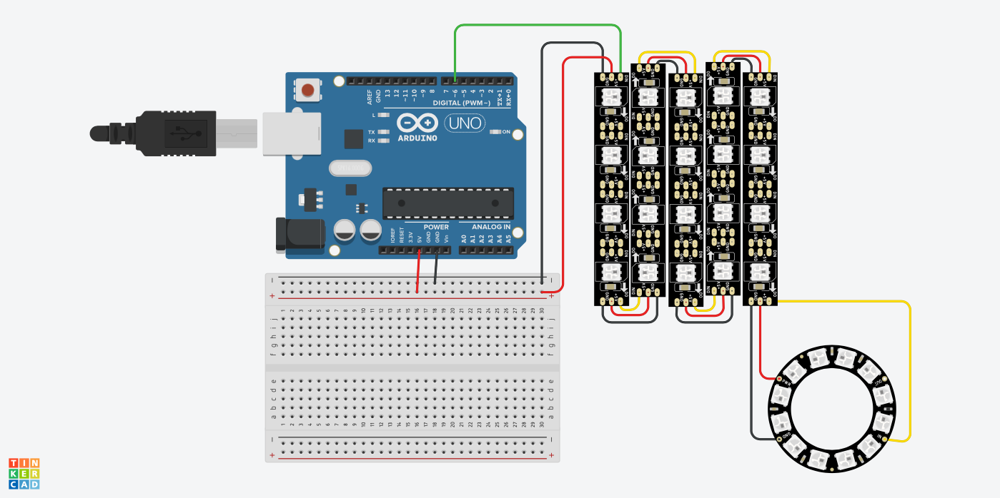

# Clase #11: Métodos combinados con Sonic Pi (Sample+CSV) y LEDs Direccionables + Neopixel en Arduino

### Actividad en Clases:
**Bloque #1**:
- Lectura de CSV con *CSV.read* en Sonic Pi (Parte 2)
- Formas de construir un CSV con valores numéricos y data alfanumérica.
- Establecer Rutas de acceso a carpetas locales mediante Ruby y Sonic Pi.
- Combinación de la lectura de Samples mediados por CSV línea por línea.
- Reproducción de muestras de audio. ([ver código](samples_csv.rb))

**Bloque #2**:
- Manejo de LEDs Direccionables con Arduino y NEOpixel.
- Explicación sobre el uso de tiras y aros LED direccionables.
- Manejo de LEDs Mediante arduino.
- Construcción de código para 5 tiras led y un aro led en conjunto.
- Uso de ejemplos de biblioteca Neopixel para arduino.

Puedes acceder al proyecto en tinkercad [acá](https://www.tinkercad.com/things/cyYBmnOAEq0-shiny-stantia)
