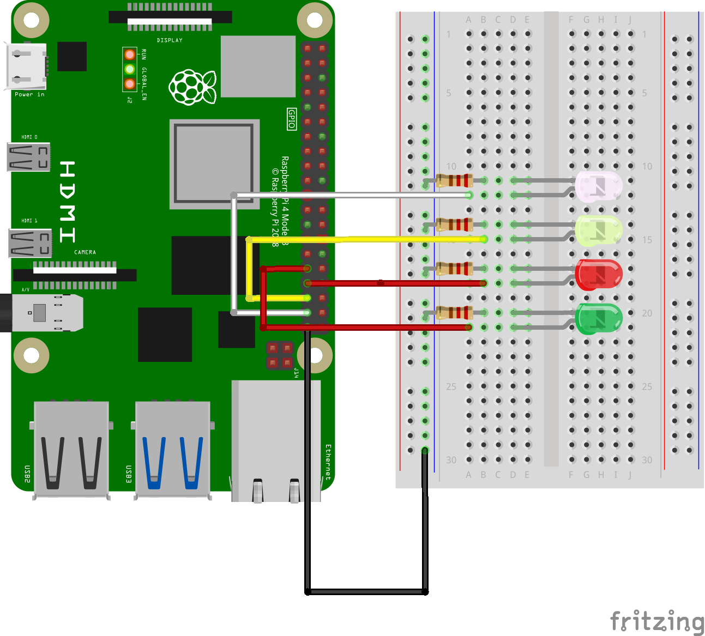

# Clase #9: Introducción a Raspberry Pi + Python + Telegram BOT

### Actividades en Clases:
**Bloque 1:** Introducción a Raspberry Pi.
- Diferencias con Arduino.
- Instalación de Raspberry OS.
- Instalación de librerías para Python mediante *PyPI* (PIP).
**Bloque 2:** Desarrollo de Proyecto en Clases.
- Diseño de Bot de mensajería en Telegram mediante *BOTFATHER*.
- Desarrollo de Script Python de Conexión entre BOT y LEDs usando puertos **GPIO** *(General Purpose Input Output)*.
- Manejo Remoto de LEDs mediante mensajería de Texto.

A partir del [MAPA de Puertos GPIO](https://learn.sparkfun.com/tutorials/introduction-to-the-raspberry-pi-gpio-and-physical-computing/gpio-pins-overview) se trabaja
con los siguientes puertos: 26 (blanco), 19 (amarillo), 13 (rojo), 6 (verde) y se agrega un quinto puerto 5 para un LED Azul. El esquemático debe quedar de la siguiente forma:

El [script en Python](leds.py) utiliza las librerías GPIO.Rpi (Conexión entre python y puertos GPIO para Raspberry); Telepot (Bot para Telegram); Time (Fecha y Hora) y estructura semánticamente
mensajes de texto basados en *if* para las instrucciones.

No olviden el Código de Autorización que provee el BOT (TOKEN_ID) que debe ser pegado en sus Scripts en la línea 83 del código.
